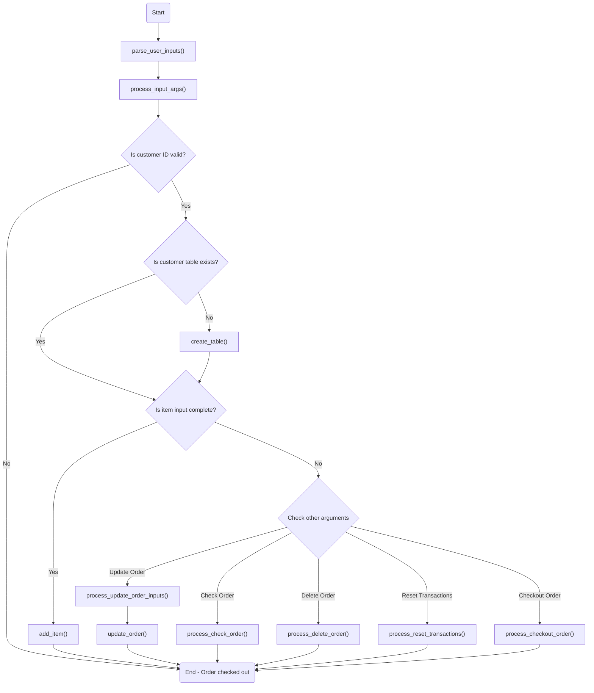

# Supermarket Self-Service Cashier System

## Latar Belakang
Andi, pemilik supermarket besar di sebuah kota di Indonesia, ingin melakukan perbaikan proses bisnis. Andi berencana untuk membuat sistem kasir self-service di supermarketnya. Sistem ini memungkinkan pelanggan untuk memasukkan item yang dibeli, jumlah item yang dibeli, dan harga item yang dibeli. Sistem ini juga memungkinkan pelanggan yang tidak berada di kota tersebut untuk membeli barang dari supermarket tersebut.

## Tujuan
Sistem kasir self-service ini dibuat dengan tujuan berikut:
- Customer dapat menambahkan item belanjaan ke dalam keranjang belanja.
- Customer dapat memperbarui item belanjaan yang telah ditambahkan ke dalam keranjang belanja.
- Customer dapat menghapus item belanjaan yang telah ditambahkan ke dalam keranjang belanja.
- Customer dapat melihat semua item belanjaan yang telah ditambahkan ke dalam keranjang belanja.
- Customer dapat melakukan checkout dan melihat total harga belanjaan.
- Customer dapat mereset semua transaksi yang telah dilakukan.
- Customer dapat melakukan checkout dan melihat total harga belanjaan dengan memperhitungkan diskon jika ada.


## Penggunaan
Berikut adalah alur dalam penggunaan program ini:
### Add Item
`python main.py --customer-id=customerid --item-name="item name" --item-price=2000 --item-counts=1`
### Update Order
`python main.py --customer-id=customerid --update-order`
### Delete Order
`python main.py --customer-id=customerid --delete-order`
### Check Order
`python main.py --customer-id=customerid --check-order`
### Reset Transactions
`python main.py --customer-id=customerid --reset-transactions`
### Checkout Order
`python main.py --customer-id=customerid --checkout-order`

## Fungsi dan Atribut
Berikut adalah penjelasan mengenai fungsi dan atribut yang dibuat dalam program ini:
| Name                          | Description                                                                                                                                                      |
|-------------------------------|------------------------------------------------------------------------------------------------------------------------------------------------------------------|
| `parse_user_inputs()`         | Fungsi ini digunakan untuk mem-parsing argumen input pengguna yang diberikan melalui command line. Fungsi ini menggunakan modul `argparse` untuk melakukan parsing. |
| `process_input_args()`        | Fungsi ini digunakan untuk memproses argumen input yang telah di-parsing oleh fungsi `parse_user_inputs()`. Fungsi ini memvalidasi ID pelanggan dan melakukan operasi yang sesuai berdasarkan argumen yang diberikan. |
| `is_valid_sql_identifier(s)` | Fungsi ini memvalidasi ID pelanggan dengan menggunakan regex. Hanya ID yang diawali dengan huruf atau underscore dan hanya berisi huruf, angka, dan underscore yang dianggap valid. |
| `create_table()`              | Fungsi ini digunakan untuk membuat tabel baru dalam database SQLite dengan nama tabel berdasarkan ID pelanggan. |
| `add_item()`                  | Fungsi ini digunakan untuk menambahkan item baru ke dalam tabel pelanggan di database. |
| `update_order()`              | Fungsi ini digunakan untuk memperbarui pesanan di dalam tabel pelanggan di database. |
| `reset_transactions()`        | Fungsi ini digunakan untuk menghapus semua transaksi dalam tabel pelanggan di database. |
| `is_table_exists(table_name)` | Fungsi ini digunakan untuk memeriksa apakah tabel dengan nama tertentu sudah ada dalam database atau belum. |
| `process_add_item()`          | Fungsi ini memproses penambahan item baru ke dalam tabel pelanggan. |
| `process_update_order_inputs()` | Fungsi ini memproses input pengguna untuk memperbarui pesanan. |
| `process_check_order()`       | Fungsi ini digunakan untuk memeriksa semua pesanan dalam tabel pelanggan. |
| `process_delete_order()`      | Fungsi ini digunakan untuk menghapus pesanan tertentu dari tabel pelanggan. |
| `process_reset_transactions()` | Fungsi ini digunakan untuk mereset semua transaksi dalam tabel pelanggan. |
| `process_checkout_order()`    | Fungsi ini digunakan untuk melakukan checkout dan menghitung total harga pesanan dengan memperhitungkan diskon jika ada. |
| `check_existing_row()`        | Fungsi ini digunakan untuk memeriksa apakah tabel pelanggan memiliki baris data atau tidak. |

## Flowchart



## Test Case
Berikut adalah demonstrasi penggunaan program dengan beberapa test case:
- Test Case 1: Menambahkan item baru ke dalam tabel pelanggan
```shell
$ python main.py --customer-id=adith --item-name=natto --item-price=20000 --item-counts=3
Pesananmu sudah kami simpan di database.

```
- Test Case 2: Memperbarui pesanan
```shell
$ python main.py --customer-id=adith --update-order                                      
Masukkan nama item baru: natto enak
Update juga harga item? (Y/N): y
Update juga jumlah item? (Y/N): y
Silahkan masukkan HARGA item yang ingin diupdate: 25000
Silahkan masukkan JUMLAH item yang ingin diupdate: 30
Proses update item selesai.
```
- Test Case 3: Melihat semua pesanan
```shell
python main.py --customer-id=adith --check-order  
[Id | 1] [Nama | natto] [Jumlah | 3] [Harga | 20000] [Total | 60000] [Diskon | 0.0] [Total setelah diskon | 60000.0]
[Id | 2] [Nama | nasi] [Jumlah | 4] [Harga | 200000] [Total | 800000] [Diskon | 0.0] [Total setelah diskon | 800000.0]
[Id | 3] [Nama | pasta gigi] [Jumlah | 10] [Harga | 120000] [Total | 1200000] [Diskon | 0.0] [Total setelah diskon | 1200000.0]
```
- Test Case 4: Menghapus pesanan. Pada skenario ini, customer sengaja melakukan perintah `--delete-order` tanpa memberikan `--item-name` spesifik sebelumnya. Maka akan terjadi error seperti pada Test case berikut:
```shell
$ python main.py --customer-id=adith --delete-order

Masukkan nama item yang ingin dihapus.

$ python main.py --customer-id=adith --check-order 
[Id | 1] [Nama | natto] [Jumlah | 3] [Harga | 20000] [Total | 60000] [Diskon | 0.0] [Total setelah diskon | 60000.0]
[Id | 2] [Nama | nasi] [Jumlah | 4] [Harga | 200000] [Total | 800000] [Diskon | 0.0] [Total setelah diskon | 800000.0]
[Id | 3] [Nama | pasta gigi] [Jumlah | 10] [Harga | 120000] [Total | 1200000] [Diskon | 0.0] [Total setelah diskon | 1200000.0]

$ python main.py --customer-id=adith --delete-order --item-name=natto
Item natto berhasil dihapus.

```
- Test Case 5: Melakukan checkout
```shell
$ python main.py --customer-id=adith --checkout-order                
Total harga: 2000000
Diskon: 7.000000000000001%
Total harga setelah diskon: 1860000.0
```
- Test Case 6: Menghapus semua transaksi. Pada skenario ini, customer ingin melakukan reset untuk menghapus semua transaksinya. Namun di awal, sempat batal dan akhirnya baru benar-benar melakukan reset.
```shell
$ python main.py --customer-id=adith --reset-transactions
Apakah kamu yakin ingin mereset transaksi? (Y/N): n
Transaksi tidak jadi direset.

$ python main.py --customer-id=adith --reset-transactions
Apakah kamu yakin ingin mereset transaksi? (Y/N): y
Transaksi customer adith berhasil direset

$ python main.py --customer-id=adith --check-order       
Data customer adith tidak memiliki record data.
```

## Kesimpulan
Program ini adalah sebuah sistem manajemen transaksi untuk sebuah toko. Fungsi utamanya adalah memungkinkan penambahan item ke sebuah pesanan, pembaruan pesanan, pengecekan pesanan, penghapusan pesanan, reset transaksi, dan checkout pesanan.

Program ini menggunakan modul argparse untuk mem-parsing argumen input pengguna yang diberikan melalui command line. Selain itu, program ini juga melakukan validasi ID pelanggan dan pengecekan keberadaan tabel pelanggan.

Secara keseluruhan, program ini dirancang untuk mempermudah proses transaksi dalam toko, memberikan fleksibilitas dalam mengelola pesanan, dan memberikan feedback yang jelas kepada pengguna melalui argumen command line.
